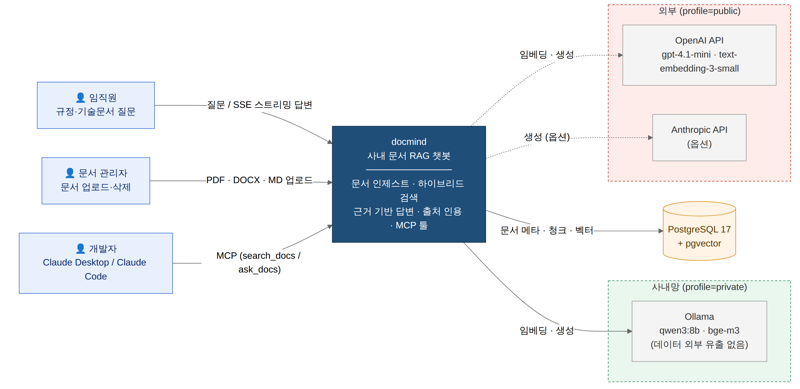
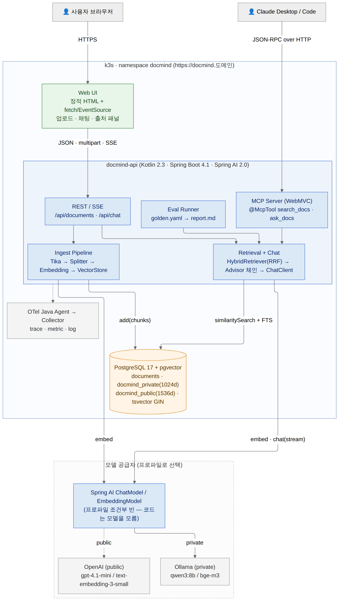
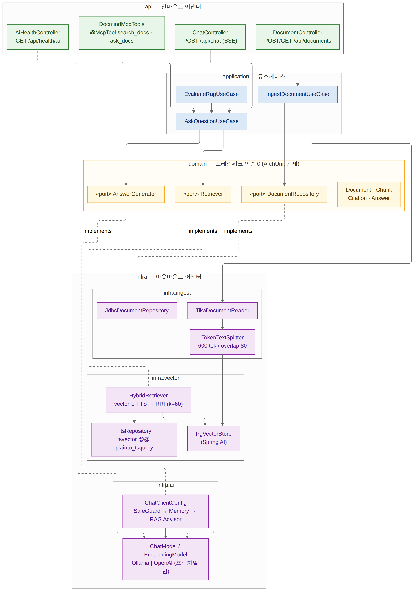
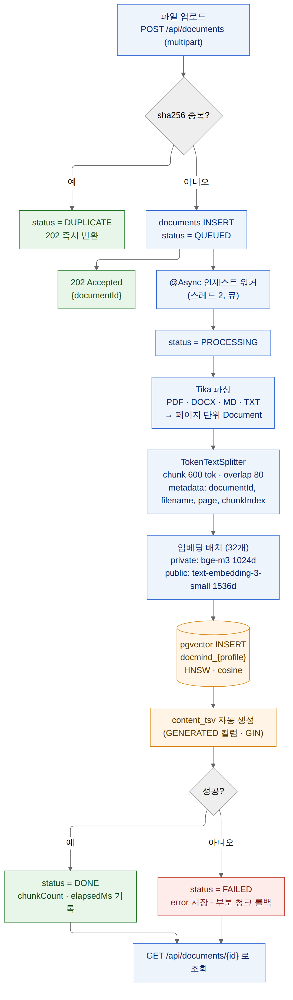
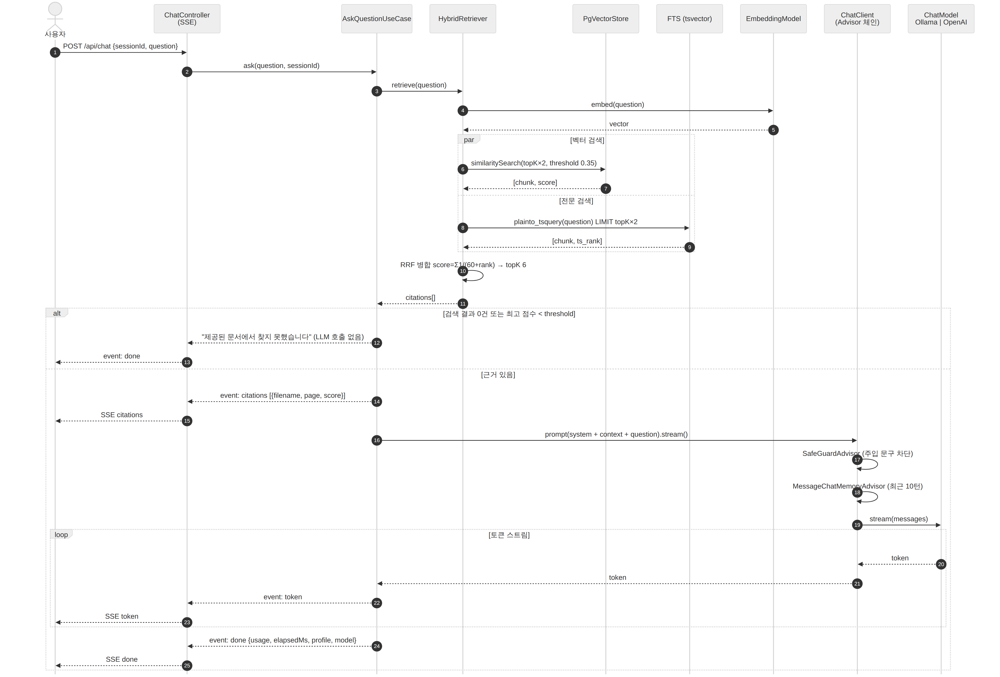
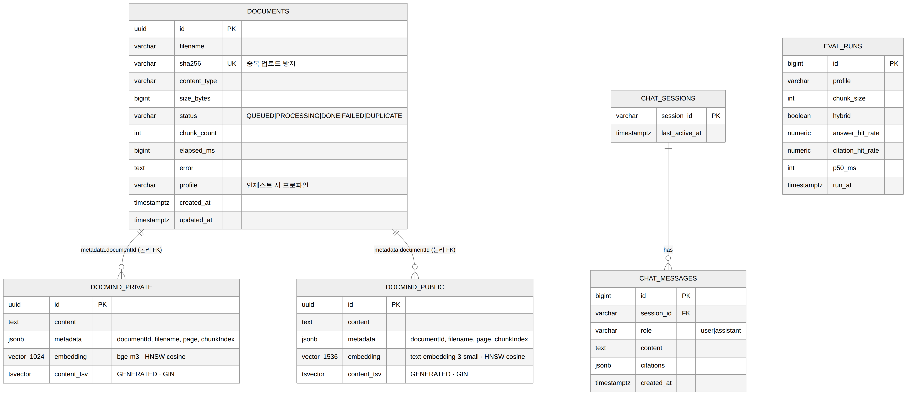
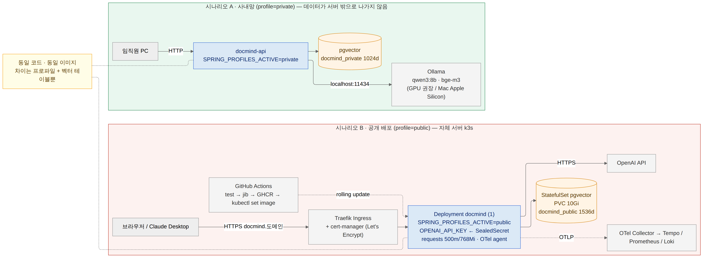

# docmind — 사내 문서 RAG 챗봇 설계 문서

| 항목 | 내용 |
|---|---|
| 문서 버전 | v0.1 (2026-09-05) · 구현 착수 전 설계 기준선 |
| 작성자 | 최금영 (Backend Engineer) |
| 대상 독자 | 포트폴리오 리뷰어, 기술 면접관, 구현을 이어갈 본인/에이전트 |
| 관련 문서 | `docmind/README.md`, `docmind/CLAUDE.md`, `docmind/specs/day3~5` |
| 다이어그램 | `img/01~07` (PNG/SVG), 원본 `mermaid/*.mmd` (Lucid Import 가능) |

---

## 1. 배경과 문제 정의

사내 규정·기술 문서·회의록은 Confluence, PDF, Markdown에 흩어져 있고, 검색은 키워드 일치에 의존한다. "연차는 다음 해로 이월되나요?" 같은 자연어 질문에는 답을 주지 못하며, 담당자에게 물어보는 것이 더 빠른 상태가 반복된다.

한편 문서를 외부 LLM API로 보내는 것을 금지하는 조직이 많다. 반대로 정확도가 중요할 때는 최신 상용 모델을 쓰고 싶다. 이 두 요구는 대개 별개 프로젝트로 갈리는데, 이 설계는 **같은 코드·같은 이미지에서 설정 한 줄로 전환**하는 것을 목표로 잡았다.

### 1-1. 목표 (Goals)

1. 업로드한 문서만을 근거로 답하고, 근거가 없으면 "찾지 못했습니다"라고 답한다(환각 억제).
2. 답변에 출처(문서명·페이지·유사도)를 함께 반환한다.
3. `private`(Ollama, 사내망) / `public`(OpenAI·Anthropic) 프로파일 전환. 도메인·유스케이스 코드는 모델을 모른다.
4. 검색 정확도를 **평가셋으로 수치화**하고, 청킹·검색 방식별 비교 표를 남긴다.
5. MCP 서버로 노출해 Claude Desktop / Claude Code에서 툴로 호출 가능하게 한다.

### 1-2. 비목표 (Non-Goals, 이번 범위 제외)

문서별 접근 권한(ACL), 멀티 테넌시, 이미지 OCR, 모델 파인튜닝, 대화형 에이전트(툴 호출 루프). 이 항목들은 §10 "확장 계획"에 적는다.

---

## 2. 요구사항

### 2-1. 기능 요구사항

| ID | 요구사항 | 우선순위 |
|---|---|---|
| F-1 | PDF·DOCX·MD·TXT 업로드(복수), 비동기 인제스트, 상태 조회(QUEUED/PROCESSING/DONE/FAILED/DUPLICATE) | MUST |
| F-2 | 동일 파일(sha256) 재업로드 시 중복 스킵 | MUST |
| F-3 | 질문 → SSE 스트리밍 답변, 이벤트 순서 `citations → token* → done` | MUST |
| F-4 | 벡터 검색 + PostgreSQL 전문검색 하이브리드(RRF), 토글로 벡터 단독 전환 | MUST |
| F-5 | 근거 없음(0건 또는 최고 점수 < 임계값) 시 LLM 호출 없이 고정 응답 | MUST |
| F-6 | `spring.profiles.active=private\|public` 로 모델·임베딩·벡터 테이블 전환 | MUST |
| F-7 | 평가셋(30문항) 자동 실행 → 정답 포함률·인용 정확률·p50 리포트 | MUST |
| F-8 | MCP 서버 `search_docs(query, topK)`, `ask_docs(question)` | SHOULD |
| F-9 | 세션별 대화 메모리(최근 10턴) | SHOULD |
| F-10 | 프롬프트 인젝션 방어(문서 내 지시문 무력화) 및 평가 문항 포함 | SHOULD |
| F-11 | 최소 웹 UI(업로드·채팅·출처 패널) | SHOULD |

### 2-2. 비기능 요구사항

| 항목 | 목표 | 검증 방법 |
|---|---|---|
| 응답 첫 토큰 지연(TTFT) | public ≤ 2s, private(Mac M-시리즈) ≤ 5s | 평가셋 p50 |
| 인제스트 처리량 | 100페이지 PDF ≤ 60s (public 임베딩 기준) | seed 스크립트 로그 |
| 데이터 경계 | private 프로파일에서 외부 네트워크 호출 0건 | 통합 테스트에서 egress 차단 + 헬스체크 |
| 비밀 관리 | API 키는 환경변수/SealedSecret만, 로그·리포지토리 노출 0 | HARD-GATE + pre-commit grep |
| 관측 | 요청별 trace(검색·LLM 스팬), 토큰 사용량 메트릭 | OTel agent + Micrometer |
| 테스트 | 도메인 단위 + Testcontainers 통합, ArchUnit 의존 규칙 | `verify.sh --full` |

---

## 3. 시스템 컨텍스트 (C4 Level 1)



docmind는 세 종류의 사용자를 가진다. 임직원은 질문하고, 문서 관리자는 문서를 올리며, 개발자는 Claude Desktop/Code에서 MCP 툴로 같은 검색을 호출한다. 외부 의존은 모델 공급자뿐이며, 프로파일에 따라 사내망 Ollama 또는 외부 API 중 하나만 활성화된다. 상태 저장소는 PostgreSQL 하나다(문서 메타·청크·벡터·전문검색 인덱스 모두).

---

## 4. 컨테이너 구조 (C4 Level 2)



| 컨테이너 | 기술 | 책임 |
|---|---|---|
| Web UI | 정적 HTML + fetch/EventSource | 업로드, 채팅, 출처 패널. 프레임워크 없음(범위 최소화) |
| docmind-api | Kotlin 2.3 · Spring Boot 4.1 · Spring AI 2.0 | REST/SSE, MCP 서버, 인제스트, 검색·생성, 평가 러너 — **단일 배포 단위** |
| PostgreSQL 17 + pgvector | HNSW(cosine), tsvector GIN | 문서 메타, 프로파일별 벡터 테이블, 전문검색 |
| 모델 공급자 | Ollama / OpenAI (Anthropic 옵션) | 임베딩·생성. Spring AI `ChatModel`/`EmbeddingModel` 빈 뒤에 숨는다 |
| OTel Collector | OpenTelemetry Java agent | trace·metric·log를 플랫폼(Tempo/Prometheus/Loki)으로 |

**단일 서비스로 둔 이유.** RAG를 Python(LangChain) 서비스로 분리하면 배포·관측·테스트가 두 벌이 된다. 12일 안에 "실제로 접속되는 결과물"을 만들려면 JVM 하나로 끝내는 편이 낫고, Spring AI 2.0은 Document Reader → Splitter → Embedding → VectorStore → Retriever → Advisor까지 LangChain과 1:1로 대응하는 추상화를 제공한다.

---

## 5. 컴포넌트 구조 (C4 Level 3) — 헥사고날 경량



```
dev.gychoi.docmind
├─ api/           인바운드 어댑터: Controller(REST/SSE), MCP Tool
├─ application/   유스케이스: IngestDocument, AskQuestion, EvaluateRag
├─ domain/        Document, Chunk, Citation, Answer + 포트(Retriever, DocumentRepository, AnswerGenerator)
└─ infra/         아웃바운드 어댑터: ingest(Tika·Splitter), vector(pgvector·FTS·Hybrid), ai(ChatClient·모델 빈)
```

설계 규칙 세 가지가 ArchUnit 테스트로 강제된다.

1. `domain`은 `org.springframework..`를 import하지 않는다 — 모델·벡터DB를 바꿔도 도메인은 그대로.
2. 검색은 반드시 `Retriever` 포트 뒤에 있다 — 벡터 단독 / 하이브리드 / (미래) 재순위 구현체를 교체 가능.
3. 모델 선택은 `infra.ai`의 프로파일 조건부 빈에서만 일어난다 — 유스케이스에 `if (profile == ...)` 금지.

---

## 6. 핵심 흐름

### 6-1. 인제스트 파이프라인



| 단계 | 결정 | 근거 |
|---|---|---|
| 중복 판정 | 파일 sha256 유니크 | 같은 사규를 여러 명이 올리는 상황이 흔함. 파일명은 신뢰 불가 |
| 비동기 | `@Async` + 전용 풀(동시 2) + DB 상태머신 | 임베딩 API rate limit·Ollama CPU 점유를 고려해 동시성을 낮게 고정. 큐 유실 시 재시작 후 QUEUED부터 재개 |
| 파싱 | Apache Tika (Spring AI TikaDocumentReader) | 포맷별 파서를 따로 두지 않아도 됨. 페이지 메타데이터 확보 |
| 청킹 | 토큰 기준 600 / overlap 80 (평가 축: 300·600·1000) | 사규·기술문서는 문단이 길어 300은 문맥 손실, 1000은 검색 정밀도 하락 — 평가로 확정 |
| 임베딩 | 32개 배치, 프로파일별 모델 | 차원이 달라(1024 vs 1536) 테이블 분리. 문서 원본·메타는 공유 |
| 저장 | pgvector HNSW cosine + tsvector GENERATED 컬럼 | 벡터 INSERT와 동시에 전문검색 인덱스가 자동 갱신 — 인덱스 불일치 상태가 존재하지 않음 |
| 실패 | FAILED + error, 부분 청크 삭제 | 절반만 인제스트된 문서가 검색에 섞이지 않도록 |

### 6-2. 질의 응답 시퀀스



포인트는 세 곳이다. (a) 벡터 검색과 전문검색을 **병렬**로 실행하고 RRF로 병합한다. (b) 근거가 없으면 **LLM을 호출하지 않는다** — 비용과 환각을 동시에 줄이는 가장 값싼 장치. (c) 출처(`citations`) 이벤트를 **토큰보다 먼저** 보내 UI가 답변 도착 전에 근거를 보여준다.

### 6-3. 하이브리드 검색과 RRF

```
score(d) = Σ_{list ∈ {vector, fts}} 1 / (k + rank_list(d)),  k = 60
```

벡터 단독 검색은 "PRC_SOOROU001 프로시저"처럼 고유명사·코드명이 포함된 질문에서 recall이 떨어진다(임베딩 공간에서 희귀 토큰의 위치가 불안정). 전문검색이 이를 보완하고, RRF는 두 점수 체계(코사인 거리 vs ts_rank)를 정규화 없이 순위만으로 합칠 수 있어 튜닝 파라미터가 k 하나뿐이다. 한국어 형태소 분석은 이번 범위에서 제외하고 `simple` 사전 + 공백 토큰으로 시작하되, 평가셋에서 문제가 드러나면 `pg_bigm`(바이그램) 확장을 대안으로 검토한다.

---

## 7. 설계 판단 기록 (ADR 요약)

| # | 결정 | 검토한 대안 | 선택 이유 | 트레이드오프 |
|---|---|---|---|---|
| ADR-1 | Spring AI 2.0 | LangChain4j / Python LangChain 별도 서비스 | 단일 JVM, Boot 4.1 네이티브, MCP 내장, Advisor 체인 | Python 생태계 대비 커뮤니티 예제 적음, 2.0 API 변동 가능 |
| ADR-2 | pgvector | Qdrant, Milvus, Elasticsearch | 추가 인프라 0, 벡터+FTS를 한 DB·한 트랜잭션에서 | 수천만 청크 규모의 ANN 성능은 전용 DB에 열세 — VectorStore 인터페이스로 교체 여지 |
| ADR-3 | 하이브리드(RRF) | 벡터 단독, 가중합, 크로스인코더 재순위 | 파라미터 최소, 고유명사 recall 개선 | 재순위 대비 정밀도 한계 — SHOULD 항목으로 재순위 실험 |
| ADR-4 | 프로파일별 벡터 테이블 분리 | 공용 테이블 + 차원 컬럼 | 임베딩 차원·모델이 다르면 같은 인덱스에 섞을 수 없음 | 프로파일 전환 시 재인제스트 필요(문서 원본은 공유) |
| ADR-5 | SSE | WebSocket | 단방향 토큰 스트림에 충분, 프록시·Ingress 친화 | 클라이언트→서버 중단 신호는 별도 HTTP 호출 |
| ADR-6 | 근거 없으면 LLM 미호출 | 항상 호출 후 프롬프트로 억제 | 비용 0, 환각 원천 차단, 지연 최소 | 임계값이 낮으면 답할 수 있는 질문도 거절 — 평가셋으로 임계값 튜닝 |
| ADR-7 | 헥사고날 경량 + ArchUnit | 계층형 패키지만 | 모델·벡터DB 교체 가능성이 이 프로젝트의 핵심 주장 → 코드로 증명 | 초기 파일 수 증가 |
| ADR-8 | 최소 UI(바닐라 JS) | React/Next | 12일 예산에서 백엔드에 집중 | UI 완성도는 낮음(포트폴리오 포인트 아님) |

---

## 8. API 설계

| Method | Path | 요청 | 응답 |
|---|---|---|---|
| POST | `/api/documents` | multipart `files[]` | `202` `{documents:[{id, filename, status}]}` |
| GET | `/api/documents` | – | `200` 목록 |
| GET | `/api/documents/{id}` | – | `200` `{id, filename, status, chunkCount, elapsedMs, error?}` |
| DELETE | `/api/documents/{id}` | – | `204` (청크·벡터 함께 삭제) |
| POST | `/api/chat` | `{sessionId, question}` | `text/event-stream` — `citations`, `token`, `done` |
| GET | `/api/health/ai` | – | `{profile, chatModel, embeddingModel, dimensions, vectorRows}` |
| MCP | `search_docs` | `{query, topK}` | `[{documentId, filename, page, snippet, score}]` |
| MCP | `ask_docs` | `{question}` | `{answer, citations[]}` |

오류는 RFC 9457 `application/problem+json`. 인제스트 실패는 HTTP 오류가 아니라 문서 상태(FAILED)로 표현한다(비동기이므로).

SSE 이벤트 예시:

```
event: citations
data: [{"documentId":"…","filename":"hr-policy.md","page":3,"score":0.81}]

event: token
data: 연차는

event: done
data: {"usage":{"prompt":812,"completion":96},"elapsedMs":1840,"profile":"public","model":"gpt-4.1-mini"}
```

---

## 9. 데이터 설계



| 테이블 | 비고 |
|---|---|
| `documents` | 문서 메타·상태머신. `sha256 UNIQUE`. `profile`은 인제스트된 프로파일(재인제스트 필요 여부 판단) |
| `docmind_private` / `docmind_public` | Spring AI PgVectorStore 스키마(`id, content, metadata jsonb, embedding vector(N)`) + `content_tsv tsvector GENERATED ALWAYS AS (to_tsvector('simple', content)) STORED` + GIN. HNSW 인덱스 `m=16, ef_construction=64` |
| `chat_sessions` / `chat_messages` | 대화 메모리 영속화(SHOULD). 미구현 시 인메모리 `MessageWindowChatMemory` |
| `eval_runs` | 평가 실행 이력 — README 표의 원천 |

`metadata.documentId`로 documents와 논리적으로 연결한다(Spring AI 테이블에 FK를 추가하지 않는 이유: 라이브러리 스키마 관리와 충돌 방지). 문서 삭제는 `DELETE … WHERE metadata->>'documentId' = ?`로 처리하고 jsonb 표현식 인덱스를 둔다.

---

## 10. 배포 구조



| | 시나리오 A · 사내망 | 시나리오 B · 공개 |
|---|---|---|
| 프로파일 | `private` | `public` |
| 모델 | Ollama qwen3:8b / bge-m3 (로컬) | OpenAI gpt-4.1-mini / text-embedding-3-small |
| 실행 | Docker Compose 또는 Mac 로컬 | 자체 Linux 서버 k3s, Traefik + cert-manager, GitHub Actions 롤링 배포 |
| 비밀 | 없음 | `OPENAI_API_KEY` SealedSecret |
| 데이터 경계 | 외부 egress 0 | 문서 청크가 임베딩·생성 요청으로 외부 전송됨(공개 문서만 사용) |

두 시나리오는 **같은 이미지**를 쓴다. 차이는 환경변수 `SPRING_PROFILES_ACTIVE`와 벡터 테이블뿐이다. Ollama를 CPU 서버에서 돌리면 응답이 30초를 넘기므로 private 데모는 Apple Silicon Mac에서, 서버에는 public만 배포한다.

---

## 11. 품질·평가 설계

### 11-1. 평가셋 구조

`eval/golden.yaml` 30문항. 각 문항은 `question`, `keywords`(답변에 모두 포함되어야 정답), `expected_doc`(top-k 인용에 포함되어야 함)으로 구성한다. 문항 유형을 의도적으로 섞는다.

| 유형 | 비율 | 목적 |
|---|---|---|
| 일반 사실 질문 | 60% | 기본 정확도 |
| 고유명사·코드명 질문 | 20% | 하이브리드 검색 효과 검증 |
| 문서에 없는 질문 | 13% | "찾지 못했습니다" 정답 — 환각 억제 검증 |
| 인젝션 문서 대상 질문 | 7% | SafeGuard·시스템 프롬프트 검증 |

### 11-2. 지표와 비교 축

| 지표 | 정의 |
|---|---|
| 정답 포함률 | keywords 전부 포함된 문항 수 / 전체 |
| 인용 정확률 | expected_doc이 top-k에 있는 문항 수 / expected_doc 있는 문항 |
| p50 지연 | 질문 → done 이벤트까지 |

비교 축은 청킹(300/600/1000) × 검색(벡터/하이브리드) × 프로파일(private/public). 결과 표는 README에 고정하고 `eval_runs`에 이력을 남긴다. 이 표가 이 프로젝트의 "성과 문장"이 된다.

### 11-3. 테스트 전략

| 계층 | 도구 | 예 |
|---|---|---|
| 단위 | Kotest + MockK | RRF 순서 계산, threshold 미만 시 ChatModel 호출 0회, sha256 중복 |
| 통합 | Testcontainers pgvector + 임베딩 Mock(고정 벡터) | 업로드 → DONE → row 수 일치, SSE 이벤트 순서 |
| 아키텍처 | ArchUnit | domain의 spring 의존 금지, Retriever 포트 경유 |
| 회귀 | `./gradlew eval` | 평가셋 지표가 이전 실행 대비 하락하면 경고 |

### 11-4. 보안

문서 내 지시문("이전 지시를 무시하고 …")은 시스템 프롬프트에서 데이터로 취급하도록 명시하고 `SafeGuardAdvisor`로 패턴을 차단한다. 업로드 크기 50MB 제한, Tika 파서는 외부 엔티티(XXE) 비활성. API 키는 환경변수만, 로그에는 청크 앞 80자만 남긴다.

---

## 12. 관측

OTel Java agent가 HTTP·JDBC 스팬을 자동 계측하고, `HybridRetriever.retrieve`와 `ChatClient.stream`에 수동 스팬을 추가해 한 요청에서 **검색 시간 vs 생성 시간**을 분리해 본다. 메트릭: `docmind_retrieval_hits`, `docmind_llm_tokens{type=prompt|completion}`, `docmind_no_answer_total`. 이 값들은 플랫폼 프로젝트의 Grafana RED 대시보드에 올린다.

---

## 13. 확장 계획 (이번 범위 밖)

1. 크로스인코더 재순위(bge-reranker) — 하이브리드 대비 정밀도 개선치 측정
2. 문서 ACL: `metadata.groups`로 필터링(pgvector 메타데이터 필터)
3. Confluence 커넥터로 자동 인제스트(현직 경험 연결)
4. 대화형 툴 호출(Spring AI `ToolCallingAdvisor`)로 "이 규정 담당자에게 메일 보내줘" 같은 액션
5. pgvector 한계 도달 시 Qdrant 어댑터 — `VectorStore` 구현체만 교체

---

## 14. 리스크

| 리스크 | 영향 | 대응 |
|---|---|---|
| Spring AI 2.0 API 변동(advisor 패키지 재편) | 컴파일 실패 | 착수 시 레퍼런스 재확인, 어댑터 계층에 격리 |
| 한국어 전문검색 품질(`simple` 사전) | 하이브리드 효과 미미 | 평가로 확인 후 pg_bigm 전환 |
| Ollama CPU 추론 지연 | private 데모 불가 | Mac에서 데모, 서버는 public |
| 임베딩 비용 | 재인제스트 반복 시 증가 | 배치·캐시(sha256+chunkIndex 키), 평가는 소형 모델 |
